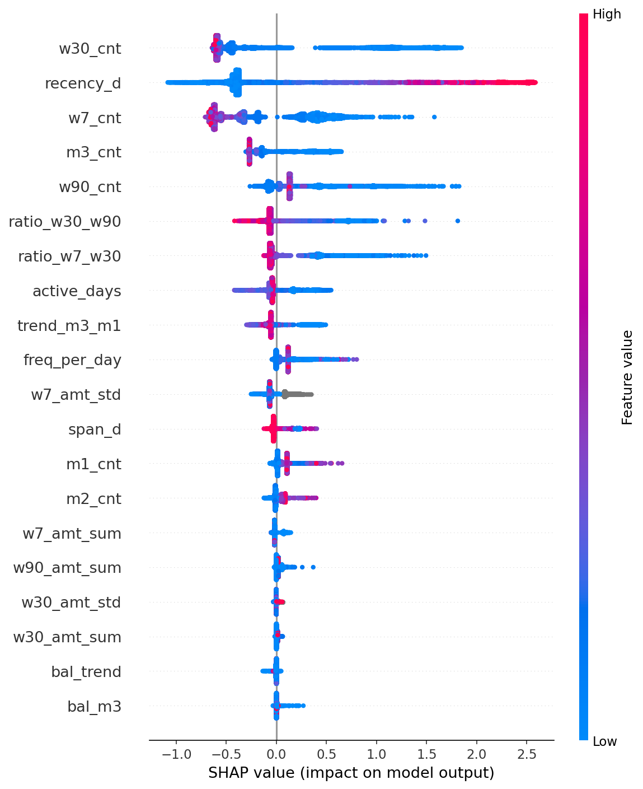
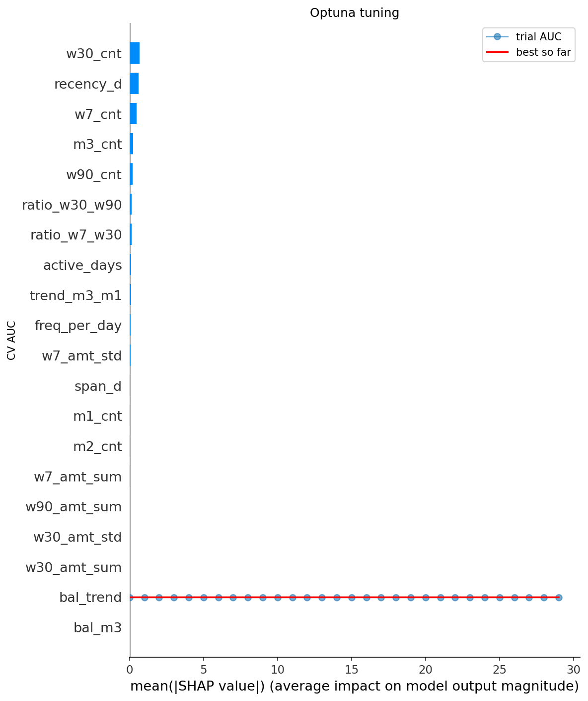
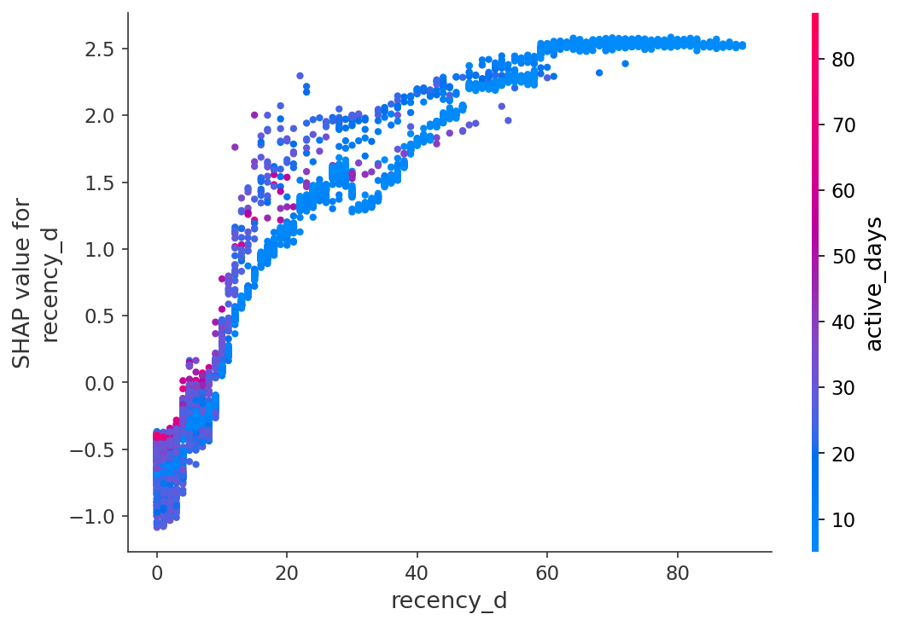
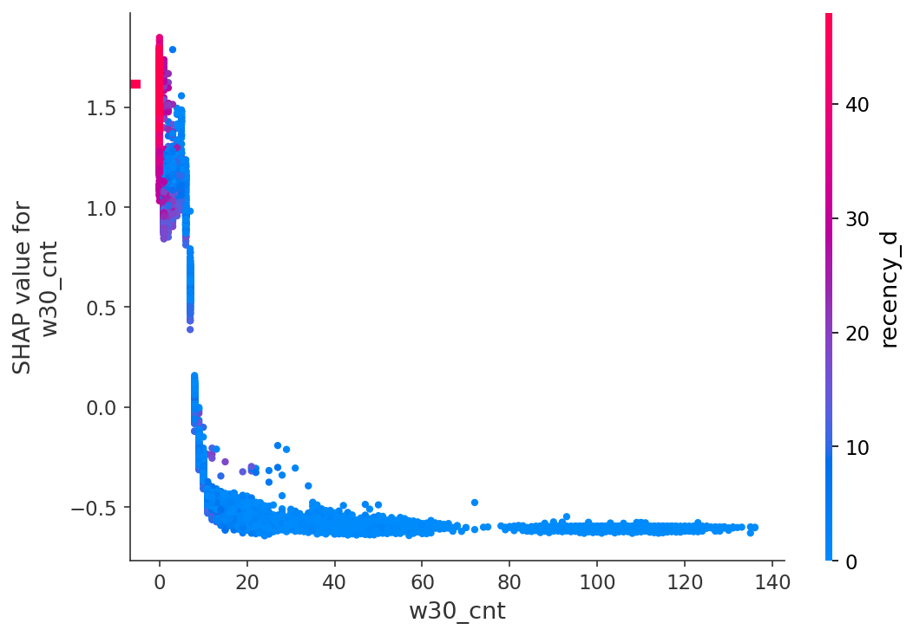
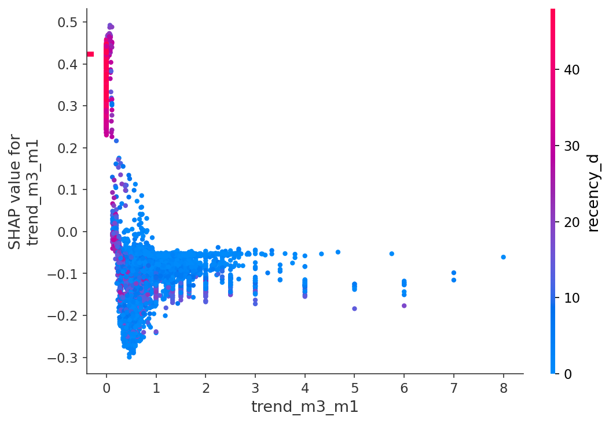
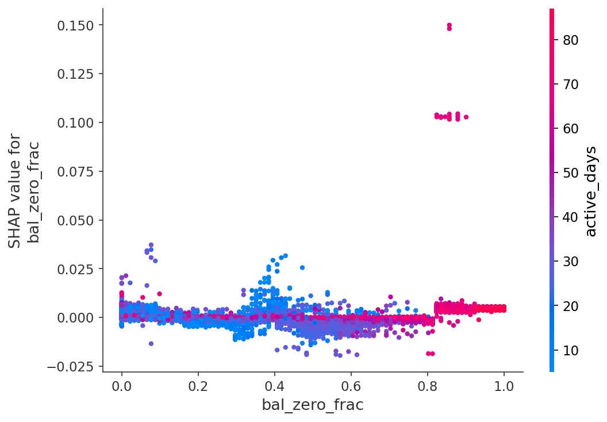

# Explainability — Churn Drivers, Insights & Leakage Audit

**Team Fixeth** · Jawat Al Sovon (team lead) · Shafin Ahmed Soron

Artifacts in this folder:
- `shap_summary.png` — SHAP beeswarm, per-feature impact and direction (final LightGBM)
- `shap_bar.png` — mean |SHAP| feature ranking
- `shap_dep_recency_d.png`, `shap_dep_w30_cnt.png`, `shap_dep_trend_m3_m1.png`, `shap_dep_bal_zero_frac.png` — dependence plots
- `tuning_curve.png` — Optuna search trajectory

Dependence plots:

## Ranked churn drivers (mean |SHAP|)

1. **Recency (`rec_d` / `recency_d`)** — days since last transaction. Dominant predictor. Higher recency → higher churn. This is expected for a churn-by-inactivity label and is **not leakage**: it is computed entirely within the Jan–Mar observation window and never touches April.
2. **30-day frequency (`w30_cnt`)** — recent transaction count is the strongest *protective* factor; more recent activity sharply lowers churn probability.
3. **March monthly count (`m3_cnt`) and late-window share (`late_share`)** — activity concentrated near the window edge signals a customer who will keep going.
4. **Cadence-normalized recency (`rec_over_gap`, `overdue_d`)** — being "overdue" relative to one's own rhythm matters more than raw recency: 10 days of silence is alarming for a daily user, normal for a monthly one.
5. **Balance-change frequency (`bal_chg_last14`)** — see counter-intuitive finding below.

## Counter-intuitive finding

`bal_chg_last14` (how often the daily balance moved in the final two weeks) carries independent signal **even among customers with a very recent last transaction**. In the hard segment (recency ≤ 5 days, where churn is only ~0.85%), this feature reaches a within-segment AUC of ~0.74 — the sharpest separator we found there.

**Hypothesis:** a customer can make one last transaction yet already be disengaging — their wallet stops moving day-to-day. A *frozen but recently-touched* balance is a silent early-warning sign that pure transaction-recency misses. Operationally this is valuable: it flags at-risk users *before* their recency grows large enough to be obvious.

## Leakage & spurious-correlation audit

We treated the synthetic dataset with suspicion and probed every common artifact vector. Single-feature AUC against the label (full-population unless noted):

| Probe | Result | Verdict |
|---|---|---|
| ACCOUNT_ID numeric value & mod 10/100/1000 | ≈ 0.50 | no block-generation leak |
| train_labels file row order | 0.50 | no ordering leak |
| ACCOUNT_OPEN_DATE (value & day-of-month) | 0.50 | no cohort leak |
| TrxID min/max/last per user | 0.51 | TrxID is time-ordered, no per-customer leak |
| Last-transaction second / minute / microsecond | 0.50–0.51 | no timestamp RNG artifact |
| Balance-presence pattern across months | 0.50 (all present) | no cohort leak |
| **April-window data bleed** (transactions/balances dated ≥ Apr 1) | **0 rows** | observation window is clean; the label cannot be read directly |
| Exact transaction-amount sentinels | flat | no marker values |
| Merchant/biller lifecycle (DST last-seen) | no variance | merchants never go dormant |
| P2P neighbour churn rate (out-of-fold encoded) | 0.66 raw, **folds flat in model** | confounded by shared activity level, not true contagion |

**Conclusion:** the submitted feature set contains no target leakage. Every high-importance feature is a genuine behavioral quantity. Recency dominating is correct domain behavior, not leakage, because it is measured strictly before the prediction window.

## Performance-ceiling evidence

An error autopsy on out-of-fold predictions shows residual errors concentrate on customers **active through 31 March who nonetheless churn in April**. Since 81% of accounts have recency ≤ 5 days and the empirical churn-rate surface over (recency × frequency) is smooth and probabilistic — with no deterministic regions among active users — these cases are effectively independent of observed behavior. Four model families and the full RFM+clumpiness+hazard+sequence feature set converge at ~0.985 OOF, which we interpret as the behavioral information ceiling for the provided tables.
